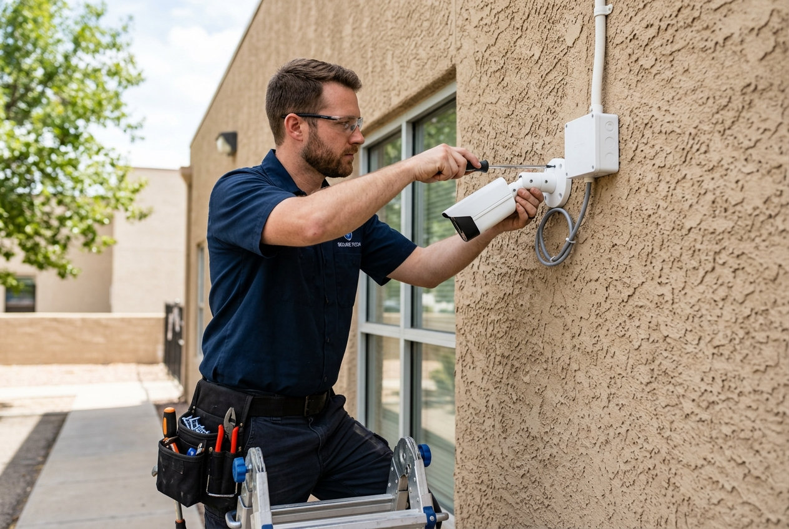

# Hanuman Enterprises - CCTV & Security Systems 🛡️



**Hanuman Enterprises** is a premium CCTV and security systems provider based in Hyderabad. This repository contains the official frontend web application, built to showcase a massive, high-performance product catalog featuring top-tier brands like **CP PLUS, Hikvision, Dahua, EZVIZ, and TP-Link**.

---

## 🚀 Key Features

- **Massive Product Catalog:** Over 150+ carefully categorized security products, ranging from basic analog domes to advanced 4G Solar PTZ cameras and 64-Channel NVRs.
- **Interactive Multi-Angle Gallery:** Every product supports a 4-angle image carousel allowing users to view products in high detail.
- **360° Interactive Viewer Integration:** Premium cameras (like TiOC and Solar models) feature an integrated 360-degree interactive viewer UI placeholder.
- **Smart Brand Filtering:** Dynamic rendering and filtering of products based on the manufacturer.
- **Ultra-Fast Performance:** Built on **Vite + React**, ensuring lightning-fast load times even with hundreds of products rendered on-screen.
- **Fully Responsive & Mobile Optimized:** Specifically optimized for single-column mobile view to maximize conversion rates.
- **Direct WhatsApp Integration:** 1-click floating action button connected directly to `+91 9014612983`.

---

## 🛠️ Technology Stack

- **Framework:** [React 18](https://reactjs.org/)
- **Build Tool:** [Vite](https://vitejs.dev/)
- **Styling:** Custom CSS3 with responsive Grid/Flexbox architecture
- **Database:** Local JSON NoSQL structure (`src/data/products.json`)

---

## 💻 Local Development

To run this project locally on your machine:

1. **Clone the repository:**
   ```bash
   git clone https://github.com/avinashbasani132/hanuman-security-systems.git
   cd hanuman-security-systems
   ```

2. **Install dependencies:**
   ```bash
   npm install
   ```

3. **Start the development server:**
   ```bash
   npm run dev
   ```

4. Open your browser and navigate to `http://localhost:5173`.

---

## 📂 Project Structure

```text
📦 hanuman-security-systems
 ┣ 📂 public
 ┃ ┣ 📂 images            # All local high-res product and hero images
 ┃ ┗ 📜 favicon.svg
 ┣ 📂 src
 ┃ ┣ 📂 assets
 ┃ ┣ 📂 components        # React UI Components (Hero, Products, Services, etc.)
 ┃ ┣ 📂 data              # Database files
 ┃ ┃ ┗ 📜 products.json   # 150+ Product configurations and specs
 ┃ ┣ 📜 App.jsx           # Main Application Container
 ┃ ┣ 📜 index.css         # Global Styles & Theming (Colors, Grids, Buttons)
 ┃ ┗ 📜 main.jsx          # React DOM Entry
 ┗ 📜 package.json
```

---

## ⚙️ How to Add New Products

Adding new products is incredibly easy. You do not need to write React code.
1. Open `src/data/products.json`.
2. Locate the relevant category (e.g., `cameras`, `dvr`, `accessories`).
3. Add a new JSON object following the schema:
```json
{
  "brand": "CP PLUS",
  "model": "CP-USC-DA24L2",
  "images": [
    "/images/products/cpplus-front.jpg",
    "/images/products/cpplus-side.jpg"
  ],
  "name": "2.4MP Analog HD Dome Camera",
  "type": "Dome / Analog HD",
  "tags": ["2.4MP", "20m IR", "Indoor"],
  "desc": "Cost-effective indoor dome camera.",
  "apps": "Indoor Home, Retail Shop",
  "specs": {
    "Brand": "CP PLUS",
    "Resolution": "2.4MP (1080P)"
  }
}
```

---

## 📄 License & Ownership

Created by Hanuman Enterprises for commercial business use. All manufacturer logos and specific product imagery (CP PLUS, Hikvision, Dahua, EZVIZ, TP-Link, etc.) are the property of their respective trademark holders.

*Built for speed, security, and sales.*
